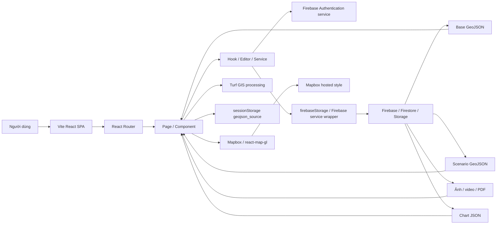
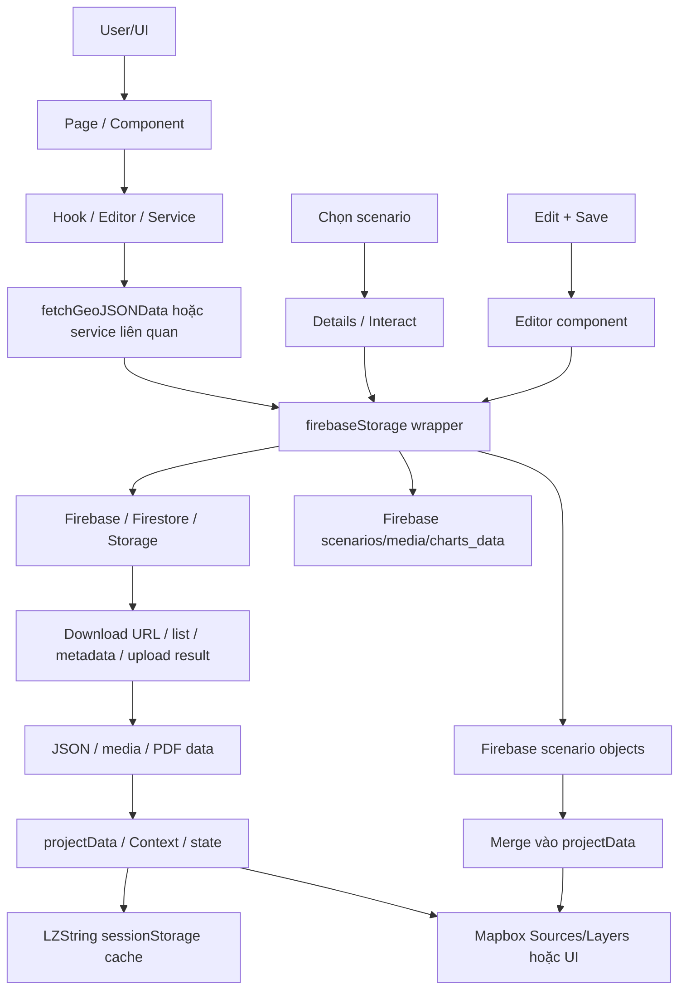
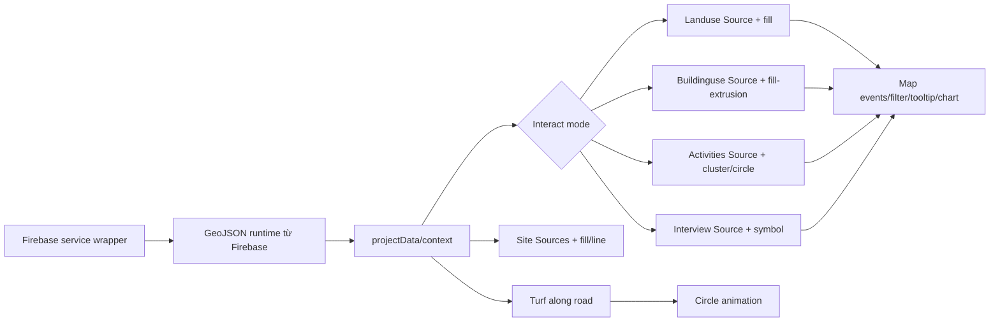
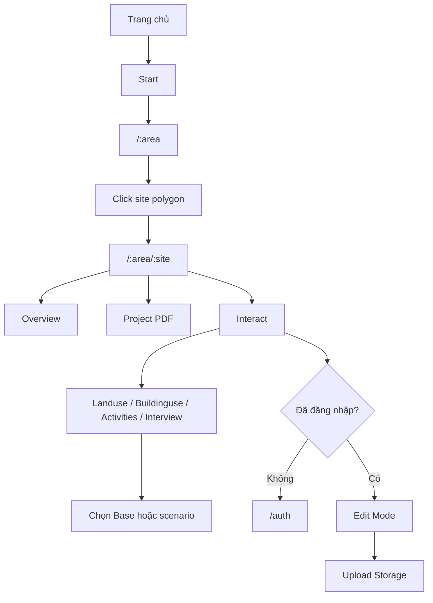
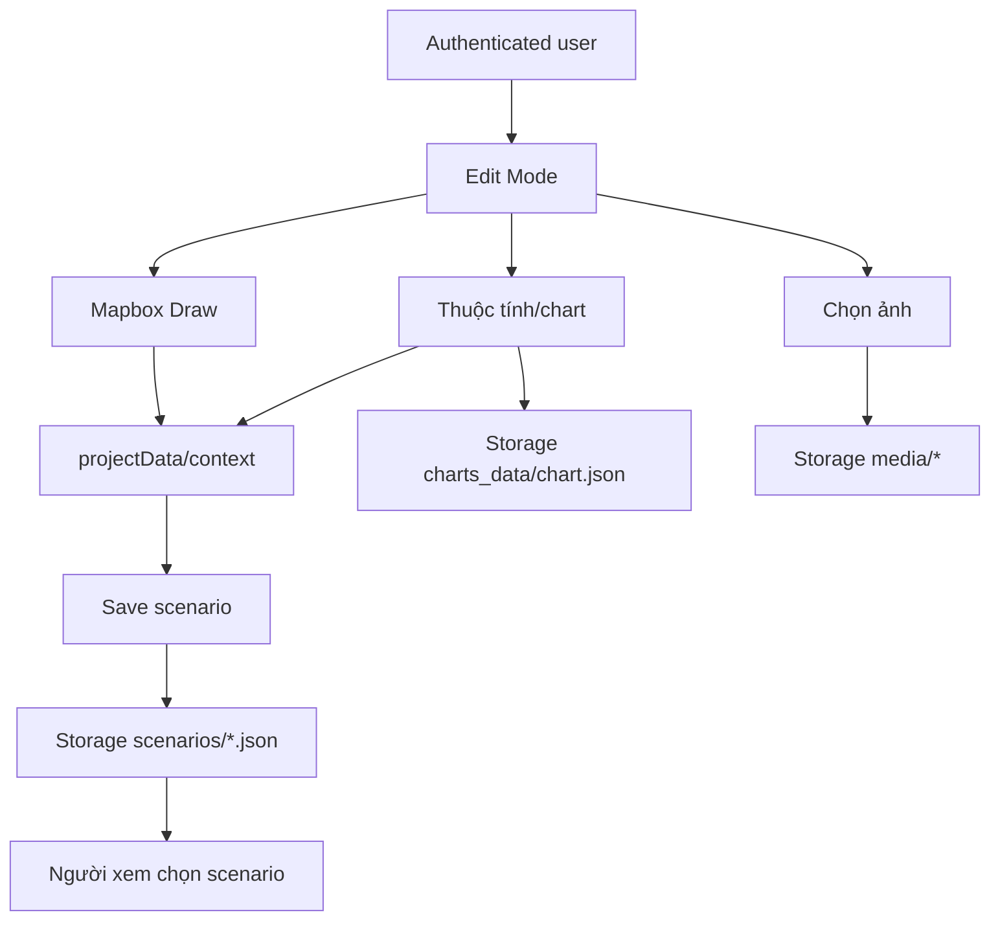

# Kiến trúc hệ thống

## 1. Kiểu kiến trúc

Ứng dụng là React SPA chạy hoàn toàn trên browser. Một `Map` duy nhất được mount trong `src/App.jsx`; các route render layer và overlay UI bên trong Map. Client giao tiếp với Mapbox và Firebase qua các service wrapper trong `src/services`, đặc biệt `firebaseStorage`. Phiên bản hiện tại chưa tách backend riêng trong repository.

## 2. System overview

## 3. Cấu trúc frontend

1. `src/main.jsx` mount `BrowserRouter`, `MapProvider` và `App`.
2. `src/App.jsx` tạo Map globe, token/style và route.
3. `HomePage` hiển thị landing/marker định hướng.
4. `SiteSelection` tải toàn bộ base GeoJSON, cache vào `sessionStorage`, render polygon site và cung cấp `SiteDataContext`/`SiteChosenContext`.
5. `Details` quản lý site, view mode, scenario và context scenario.
6. `Interact` chọn một trong bốn mode GIS và tải scenario.
7. Mỗi mode tự khai báo `Source`, `Layer`, event handler, filter/chart và editor.

State không dùng Redux/Zustand/query library. Dữ liệu được truyền bằng React Context và cập nhật trực tiếp trong object/array ở một số chỗ.

## 4. Firebase data flow

Các `*.json` trong sơ đồ là object/path được quản lý qua Firebase service wrapper, không phải file JSON local trong repository.

## 5. Map rendering flow

## 6. User interaction flow

## 7. Update data flow

## 8. Cache và lifecycle dữ liệu

- Base GeoJSON được tải nối tiếp, sau đó nén vào `sessionStorage` key `geojson_source`.
- Cache không có version/TTL; dữ liệu base thay đổi trên Storage sẽ không tự cập nhật trong cùng tab/session.
- Scenario được merge vào `projectData`; chọn Base dùng dữ liệu giải nén từ `sessionStorage`.
- Editor cập nhật cả Map source và context. Việc save upload toàn bộ nhóm dataset, không chỉ feature vừa sửa.
- `src/assets/data/data.js` được xác nhận là dữ liệu backup thủ công cho base map trên cloud; không được coi là nguồn dữ liệu runtime chính.
- `src/assets/data/chartdata.js` chỉ là fallback chart Base của Interview khi không chọn scenario Storage.

## 9. Backend/API

- Không có backend/server/API route.
- `fetch()` chỉ dùng với Firebase download URL và PDF worker CDN.
- Firebase SDK được sử dụng từ client qua các service wrapper trong `src/services`.
- `vercel.json` rewrite mọi route không có dấu chấm về `/` để hỗ trợ SPA routing.
